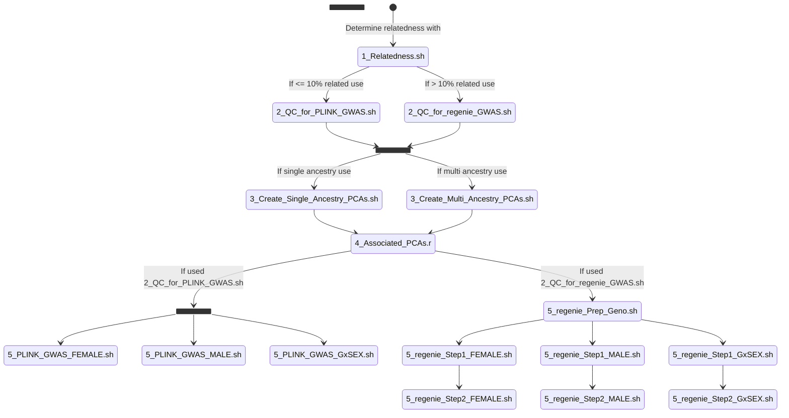

# PGC - Sex-stratified GWAS of depression 
Major Depressive Disorder (MDD) is more common in women, with a lifetime prevalence nearly twice as high than in men (7.2% to 4.3%). It would be valuable to consider how common genetic variation influences liability to MDD on a sex-specific basis. GWAS has reached a point where adequate power may be available to identify risk loci which exhibit sex specific effects, differences in heritability, and patterns of genetic correlations.

The goals of this research are to investigate sex specific risk loci for Major Depression. We propose to perform genetic discovery using GWAS approaches and meta-analysis in a sex stratified fashion on the autosomes. We will use a combined approach of using available individual data from the Psychiatric Genomics Consortium to stratify by sex as well as allowing for sex stratified summary statistics to be contributed by groups not already sharing individual level data. Additionally a genotype-by-sex interaction analysis will be performed.

Where possible, we will use XWAS to move beyond autosomal differences to investigate the X chromosome in genotyped samples with available data. LDSC will be used to calculate heritabilities and phenome-wide comparative genetic correlation between sex stratified analyses.  MAGMA will be used to investigate tissue enrichments. We will calculate and compare effect sizes at discovered loci as well as heritability and genetic correlations. 

## Embargo date

All results found here cannot be share, discussed, or presented in any way without explicit permission from Joel Gelernter, Dan Levey, Murray Stein, or David Howard.

## Imputation

If your data is already imputed then skip to the ‘Post-imputation Quality Control’, although the tools, reference panels, and parameters used for imputation should be reported to the lead authors.

Imputation should be performed using the ricopili pipeline:

Manuscript - https://academic.oup.com/bioinformatics/article/36/3/930/5545088

Website - https://sites.google.com/a/broadinstitute.org/ricopili/overview

Tutorial - https://docs.google.com/document/d/1ux_FbwnvSzaiBVEwgS7eWJoYlnc_o0YHFb07SPQsYjI/edit?tab=t.0#heading=h.tkgxq8x9kt6n

Imputation is a multi-stage process of pre-imputation quality control, PCA, and imputation. Analysts should familiarise themselves with the ricopili documentation shown above.  

The default settings should be used for the ‘preimp’ and ‘pca’ modules.

A detailed QC report will be generated during the ‘preimp’ stage and will be placed in the ‘qc/’ subdirectory and this report should be shared with the lead authors to aid with manuscript writing. Any ‘amber’ and ‘red’ flags should be examined, and steps should be taken (see ricopili tutorial) to address the identified issues. Please keep a record of the steps taken and share those with the lead authors.

To conduct the imputation, the largest reference panel suitable for the ancestry of your data should be used. For example, for European ancestry data the HRC panel should be used, whilst other ancestries are generally better represented using the relevant 1000 genomes panel. Please record which panel was used and report this to the lead authors.

The imputed data should be converted to best guess/hard called genotypes with variants with an imputation accuracy (INFO) score less than 0.6 removed.

If you have X chromosome data, then the imputation should be conducted separately for males and females and follow the guidance provided here: https://docs.google.com/document/d/1qeQFfvqNI2Lkp6XCYXmnGoEL3f9LRPJcMpwRk0rnJf4/edit?tab=t.0#heading=h.eti7izkzx2ko

## Post Imputation Steps 
### Autosomal chromosomes

The ricopili imputation pipeline lifts the data over the build to hg19. If a different tool was used for imputation, then you will need to check that your data is aligned with build hg19. If your data is not using build hg19, then visit: https://genome.sph.umich.edu/wiki/LiftOver which contains guidance on how best to update the genome build for your data.

We have prepared sample code using PLINK2, regenie, eigensoft, and R for the remaining steps which is located here: https://github.com/psychiatric-genomics-consortium/sex-stratified-depression/tree/master/post_imputation. There are comments at the top of each sample code with instructions. 

The sample code should be placed in a working directory, containing either the imputed data or symbolic links to it. The sample code expects your imputed data to be in best guess/hard called bed/bim/fam PLINK format with sex in column 5 (male = 1, female = 2) of the fam file.

A three column depression phenotype file (Family ID, Individuals ID, depression status (control = 1, case = 2)) is expected in the working directory and will need to have the same name as your imputed data with a .pheno suffix. A header row in the phenotype file is optional if you are planning to use PLINK for the GWAS, but regenie will require a header row (FID, IID, depression). If your depression phenotype is also in column six of the fam file and you plan to use PLINK for the GWAS, you will need to delete the lines starting --pheno from the GWAS scripts in step 5, otherwise the GWAS will be performed twice with two identical outputs.

The sample code assumes that all software can be loaded using ‘module load’. If this isn’t the case, then you will need to download and install the software and update the sample code to point to the relevant executable.

All sample code should be treated as a beta testing software release. All log and output files should be checked carefully to make sure the code has performed as expected for your data. 

The schematic below illustrates the pipeline and sample code available in the post-imputation folder: https://github.com/psychiatric-genomics-consortium/sex-stratified-depression/tree/master/post_imputation


 
#### Step 1

Step 1 is to examine your data to determine the proportion of second-degree relatives in your data using the KING-robust kinship estimator in PLINK. This can be done using:

https://github.com/psychiatric-genomics-consortium/sex-stratified-depression/blob/master/post_imputation/1_Relatedness.sh

To identify the proportion of relatives you will need to compare the number of individuals written to *king.cutoff.out.id with the number of individuals in the fam file. Note that’s the *king.cutoff.out.id contains a header row so you will need to subtract 1 if you use wc -l * king.cutoff.out.id to count the number of rows.

If the proportion of related individuals is less than or equal to 10% of the whole sample, then you can opt to remove them and run the GWAS using PLINK. If your sample contains more than 10% related individuals, then regenie is the preferred way to conduct the GWAS. You can also opt to use regenie regardless of the relatedness in your sample.

#### Step 2

Step 2 is to apply quality control to prepare the data for either a PLINK (removing relatives) or a regenie GWAS (not removing relatives). The quality control removes individuals that aren’t phenotyped, don’t have a recoded sex or have an individual call rate less than 10%. Variants are removed which have a minor allele frequency < 0.005, have a variant call rate less than 10%, that are out of Hardy-Weinberg equilibrium with p < 10-6, or that aren’t biallelic. Two additional subsamples are also created: one for males only and one for females only with the quality control applied to each of those subsamples.

To prepare for a PLINK GWAS use:

https://github.com/psychiatric-genomics-consortium/sex-stratified-depression/blob/master/post_imputation/2_QC_for_PLINK_GWAS.sh

or to prepare for a regenie GWAS use:

https://github.com/psychiatric-genomics-consortium/sex-stratified-depression/blob/master/post_imputation/2_QC_for_regenie_GWAS.sh

#### Step 3

Step 3 is to obtain the first 20 genetic principal components (PCs). If the ricopili pipeline was used, these PCs are created during the ‘pca’ module and stored in pacer_{filename}/{filename.menv.mvs} and these can be used. If you don’t have access to these PCs or didn’t use ricopili, then the PCs can be created using the scripts below. If your data was obtained from a single ancestry, then PLINK can be used. If your data contains individuals from multiple ancestries, then eigensoft is recommended. The PCs are created from SNPs that are in linkage equilibrium (using 200kb window and r2 threshold of 0.5), have a minor allele frequency > 0.05, and are not located in high LD regions (based on https://github.com/gabraham/flashpca/blob/master/exclusion_regions_hg19.txt).

To create PCs for a single ancestry cohort use:

https://github.com/psychiatric-genomics-consortium/sex-stratified-depression/blob/master/post_imputation/3_Create_Single_Ancestry_PCAs.sh

or to create PCs for a multi ancestry cohort use:

https://github.com/psychiatric-genomics-consortium/sex-stratified-depression/blob/master/post_imputation/3_Create_Multi_Ancestry_PCAs.sh

#### Step 4

Step 4 is to determine the PCs that will be included as covariates in the GWAS. The first 4 PCs and thereafter each component nominally associated (p<0.05) with case-control status should be included. A logistic regression of depression status on each component in turn should be used to determine an association and this can be achieved using the following R code:

https://github.com/psychiatric-genomics-consortium/sex-stratified-depression/blob/master/post_imputation/4_Associated_PCAs.r

It is then down to the analyst to prepare a covariate file combining these PCs with other appropriate covariates for each analysis, such as age, genotyping batch, etc. The covariates should have a header row, with the first two columns containing FID and IID, with the remaining columns containing the associated PCs and any other covariates. For the whole sample genotype-by-sex interaction analysis, sex (1 = male, 2 = female) is automatically added based on column 5 in the .fam file.

#### Step 5

Step 5 is to run the GWAS. There are three association analyses to be performed: whole sample with a genotype-by-sex interaction, male-only, and female-only.  If your sample includes only one sex, then only an analysis of that sex is possible. File formats and naming conventions are provided at the end of the document, and these should be followed as closely as possible.


If related individuals were removed in step 2 then run the following scripts to run the three GWAS in **PLINK**. You will need to update the --parameters line for the GxSex analysis to provide the correct values based on the number and position of your covariates, see sample code for details:

https://github.com/psychiatric-genomics-consortium/sex-stratified-depression/blob/master/post_imputation/5_PLINK_GWAS_GxSEX.sh

https://github.com/psychiatric-genomics-consortium/sex-stratified-depression/blob/master/post_imputation/5_PLINK_GWAS_FEMALE.sh

https://github.com/psychiatric-genomics-consortium/sex-stratified-depression/blob/master/post_imputation/5_PLINK_GWAS_MALE.sh


If you have relatedness in your sample or you are intending to use **regenie** for the GWAS then there are multiple stages to this analysis. Firstly, a genomic relationship matrix is created using the original genotyped variants. You need to create a single-column list of genotyped variants’ IDs for your data and save it in a file called genotypedvariants.txt with no header row in your working directory. Then running the following code will apply the required quality control (minor allele frequency of ≥1%, a Hardy–Weinberg equilibrium test not exceeding P = 1 × 10−15, a variant call rate above 99%, and LD pruned using a R2 threshold of 0.9 with a window size of 1,000 markers and a step size of 100 markers):

https://github.com/psychiatric-genomics-consortium/sex-stratified-depression/blob/master/post_imputation/5_regenie_Prep_Geno.sh

Then you need to run step1 of regenie:

https://github.com/psychiatric-genomics-consortium/sex-stratified-depression/blob/master/post_imputation/5_regenie_Step1_GxSEX.sh

https://github.com/psychiatric-genomics-consortium/sex-stratified-depression/blob/master/post_imputation/5_regenie_Step1_FEMALE.sh

https://github.com/psychiatric-genomics-consortium/sex-stratified-depression/blob/master/post_imputation/5_regenie_Step1_MALE.sh

followed by step 2 of regenie:

https://github.com/psychiatric-genomics-consortium/sex-stratified-depression/blob/master/post_imputation/5_regenie_Step2_GxSEX.sh

https://github.com/psychiatric-genomics-consortium/sex-stratified-depression/blob/master/post_imputation/5_regenie_Step2_FEMALE.sh

https://github.com/psychiatric-genomics-consortium/sex-stratified-depression/blob/master/post_imputation/5_regenie_Step2_MALE.sh

Please also prepare a readme file to accompany the summary statistics based on the description at the end of this document.

### X chromosome

The ricopili imputation pipeline lifts the data over the build to hg19. If a different tool was used for imputation, then you will need to check that your data is aligned with build hg19. If your data is not using build hg19, then visit: https://genome.sph.umich.edu/wiki/LiftOver which contains guidance on how best to update the genome build for your data.

It is assumed that you will have already run the analysis of the autosomal chromosomes as some of that output (list of related individuals and covariate file) are reused here. We have prepared sample code using XWAS for the remaining steps which is located here: https://github.com/psychiatric-genomics-consortium/sex-stratified-depression/tree/master/post_imputation. There are comments at the top of each sample code with instructions. 

The sample code should be placed in the same working directory used for the autosomal analysis which contains either the imputed data or symbolic links to it. The sample code expects genome-wide (autosomes plus the X chromosome) imputed data to be in best guess/hard called bed/bim/fam PLINK format with sex in column 5 (male = 1, female = 2) of the fam file.

A three column depression phenotype file (Family ID, Individuals ID, depression status (control = 1, case = 2)) is expected in the working directory and will need to have the same name as your imputed data with a .pheno suffix. A header row in the phenotype file is optional.
All sample code should be treated as a beta testing software release. All log and output files should be checked carefully to make sure the code has performed as expected for your data. 

The XWAS software (https://github.com/KeinanLab/xwas-3.0) is recommended for the quality control and association analysis and a useful manual is available here: https://github.com/KeinanLab/xwas-3.0/blob/master/XWAS_manual_v3.0.pdf.

From your existing working directory clone the XWAS repository from Github using:
```$ git clone https://github.com/KeinanLab/xwas-3.0.git```

#### Step 1

Step 1 is to run quality control on your data. Information on post-imputation QC is in section 5.3 in the XWAS manual. The following sample code will perform the recommended quality control:

https://github.com/psychiatric-genomics-consortium/sex-stratified-depression/blob/master/post_imputation/X1_QC.sh

#### Step 2

Step 2 is to conduct the association analysis of the X chromosome. Section 6 of the XWAS manual provides further details on the variant association testing. The following sample code will perform the recommended analyses of the X chromosome: 

https://github.com/psychiatric-genomics-consortium/sex-stratified-depression/blob/master/post_imputation/X2_XWAS.sh


### File formats and naming conventions

•	Save data as a gzip-compressed, tab-separated plain text file

•	Filename: COHORT[-SUBCOHORT]_CLUSTER_SEX_SOMES_VERSION.FORMAT.gz

o	COHORT: abbreviation or code for cohort name. E.g., UK Biobank = UKBB, Generation Scotland = GenScot

o	SUBCOHORT: Subcohort or substudy name, separated from cohort abbreviation by a hyphen (optional). For example, for GenScot: Scottish Family Health Study = -SFHS ("GenScot-SFHS").  Only required if submitting multiple sumstats files from subcohorts that are part of the same study.

o	CLUSTER: Genetic similarity cluster abbreviation (three letter code, upper case; i.e., AFR, AMR, CSE, EAS, EUR, MID, HIS, SAS).

o	SEX: FEMALE, MALE, or BOTH

o	SOMES: Chromosomes included in file (AUTO = autosomes, ALLO = sex chromosomes)

o	VERSION: Version identifier for this analysis, to indicate dataset release / analyst / date etc. Examples: UK Biobank → ukb21007-hrc-noPGC,  Biobank Japan → SakaueKanai2020, FinnGen → R12.

o	FORMAT: sumstats format (plink, regenie, daner, xwas)

•	For COHORT, SUBCOHORT, and VERSION, use only letters, numbers, and hyphens (no spaces, periods, underscores, or other punctuation).

Sumstats required information

Sumstats (output from regenie, plink2, XWAS, Ricopoli) should have the following information:

•	Chromosome (CHR): 1-23 (numeric)

•	Marker (ID, SNP): Variant identifier, preferably reference SNP ID (rsID). If rsID not available: chromosome-position (CPID) formatted as CHR_POS_REF_ALT

•	Basepair position (POS, BP): GRCh37

•	Effect allele 

o	PLINK: A1

o	regenie: allele1

o	daner: A1

•	Non-effect allele

o	PLINK: A2

o	regenie: allele0

o	daner: A2

•	Frequency of effect allele in cases and controls

o	PLINK: A1_CASE_FREQ, A1_CTRL_FREQ

o	regenie: A1FREQ_CASES, A1FREQ_CONTROLS

o	daner: FRQ_A, FRQ_U

•	Sample size of cases and controls

o	PLINK: A1_CASE_FREQ, A1_CTRL_FREQ, ALLELE_CT, OBS_CT

o	regenie: N_CASES, N_CONTROLS

o	daner: Nca, Nco

•	Imputation info score 

o	PLINK: MACH_R2

o	regenie: INFO

o	daner: INFO

•	Effect size: Odds ratio or log(Odds ratio)

o	PLINK: OR

o	regenie: BETA

o	daner: OR

•	Standard error: SE of log(OR)

o	PLINK: LOG(OR)_SE

o	regenie: SE

o	daner: SE

•	Test statistic of association 

o	PLINK: Z_STAT

o	regenie: CHISQ

•	Association test -log10(p-value)

o	PLINK: NEG_LOG10_P

o	regenie: LOG10P

### README file

Prepare a plaintext file with analyst and study information called COHORT[-SUBCOHORT]_VERSION.readme. Include:

•	Contact name, institution, email

•	Study name

•	PIs and analyst names, emails, and ORCiDs

•	Study description.

•	Total numbers of cases and controls for each analysis

•	Array version(s), imputation panel, and genotype build.

•	Genotyping and association analysis details

•	Ethics statements

•	PubMed ID references

•	Grant codes and acknowledgments

## Built With

* [PLINK2](https://www.cog-genomics.org/plink/2.0/)
* [eigensoft](https://github.com/DReichLab/EIG)
* [R](https://www.r-project.org/)
* [regenie](https://rgcgithub.github.io/regenie/options/)

## Lead Analysts

* **David Howard** - *analyst* - [PGC](https://med.unc.edu/pgc)
* **Joel Gelernter** - *analyst* - [PGC](https://med.unc.edu/pgc)
* **Dan Levey** - *analyst* - [PGC](https://med.unc.edu/pgc)
* **Murray Stein** - *analyst* - [PGC](https://med.unc.edu/pgc)
* **Mark Adams** - *analyst* - [PGC](https://med.unc.edu/pgc)

## License

This project is licensed under MIT License - see the [LICENSE](LICENSE) file for details

## Acknowledgments

* Andrew McIntosh, Cathryn Lewis, Swapnil Awasthi, Brittany Mitchell
