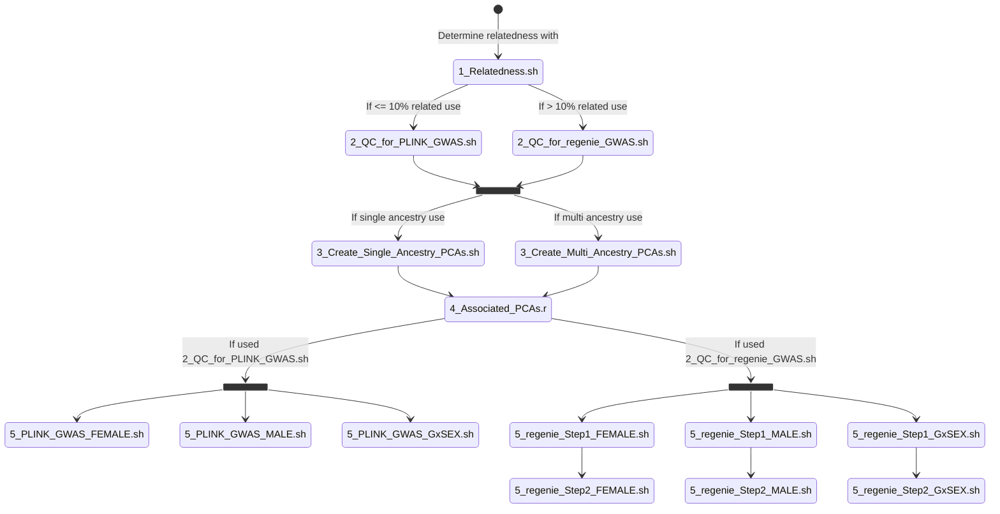

# pgc-template Project Title
Starting points for new PGC repositories. One paragraph of project description goes here.

## Embargo date

These data are private to WHAT DISTRIBUTION until DATE. All results found here cannot be share, discussed, or presented in any way without explicit permission from WHOM. 

## Project overview

More detail. PGC group. Analysis. Samples. Processing. Genome build. Imputation reference. Where data are. Who did what when. Or, classic who what where when how why. 

### Post Imputation Steps 
## - Autosomal chromosomes




 
 
### Step 1

Describe this step

```
Code used 1
```

### Step 2

Describe this step

```
Code used 2
```

### Step 3

Describe this step

```
Code used 3
```

And repeat

```
until finished
```

## Checking the results

Sanity checks on results. 

## Built With

* [Dropwizard](http://www.dropwizard.io/1.0.2/docs/) - The web framework used
* [Maven](https://maven.apache.org/) - Dependency Management
* [ROME](https://rometools.github.io/rome/) - Used to generate RSS Feeds

## Analysts

* **Person Numberone** - *analyst* - [PGC](https://med.unc.edu/pgc)

## License

This project is licensed under XXX License - see the [LICENSE.md](LICENSE.md) file for details

## Acknowledgments

* readme template from https://gist.github.com/PurpleBooth/109311bb0361f32d87a2#file-readme-template-md
* Hat tip to anyone whose code was used
* Inspiration
* etc

