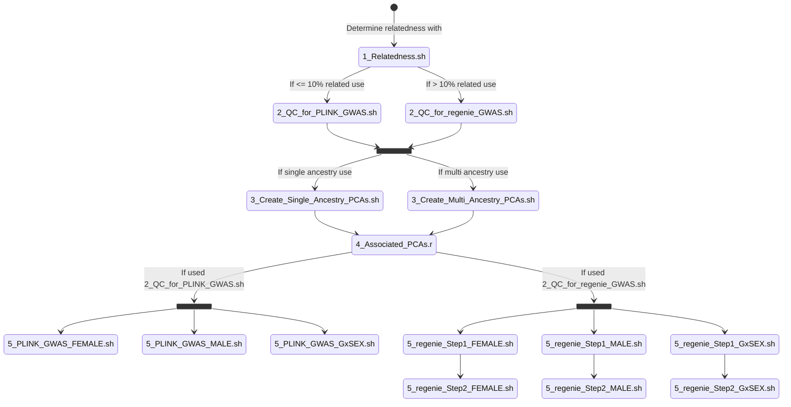

# PGC - Sex-stratified GWAS of depression 
Major Depressive Disorder (MDD) is more common in women, with a lifetime prevalence nearly twice as high than in men (7.2% to 4.3%). It would be valuable to consider how common genetic variation influences liability to MDD on a sex-specific basis. GWAS has reached a point where adequate power may be available to identify risk loci which exhibit sex specific effects, differences in heritability, and patterns of genetic correlations.

The goals of this research are to investigate sex specific risk loci for Major Depression. We propose to perform genetic discovery using GWAS approaches and meta-analysis in a sex stratified fashion on the autosomes. We will use a combined approach of using available individual data from the Psychiatric Genomics Consortium to stratify by sex as well as allowing for sex stratified summary statistics to be contributed by groups not already sharing individual level data. Additionally a genotype-by-sex interaction analysis will be performed.

Where possible, we will use XWAS to move beyond autosomal differences to investigate the X chromosome in genotyped samples with available data. LDSC will be used to calculate heritabilities and phenome-wide comparative genetic correlation between sex stratified analyses.  MAGMA will be used to investigate tissue enrichments. We will calculate and compare effect sizes at discovered loci as well as heritability and genetic correlations. 

## Embargo date

All results found here cannot be share, discussed, or presented in any way without explicit permission from Joel Gelernter, Dan Levey, Murray Stein, or David Howard.

## Project overview

More detail. PGC group. Analysis. Samples. Processing. Genome build. Imputation reference. Where data are. Who did what when. Or, classic who what where when how why. 

### Post Imputation Steps 
#### - Autosomal chromosomes




 
 
### Step 1

Describe this step

```
Code used 1
```

### Step 2

Describe this step

```
Code used 2
```

### Step 3

Describe this step

```
Code used 3
```

And repeat

```
until finished
```

## Checking the results

Sanity checks on results. 

## Built With

* [Dropwizard](http://www.dropwizard.io/1.0.2/docs/) - The web framework used
* [Maven](https://maven.apache.org/) - Dependency Management
* [ROME](https://rometools.github.io/rome/) - Used to generate RSS Feeds

## Analysts

* **Person Numberone** - *analyst* - [PGC](https://med.unc.edu/pgc)

## License

This project is licensed under XXX License - see the [LICENSE](LICENSE) file for details

## Acknowledgments

* readme template from https://gist.github.com/PurpleBooth/109311bb0361f32d87a2#file-readme-template-md
* Hat tip to anyone whose code was used
* Inspiration
* etc

